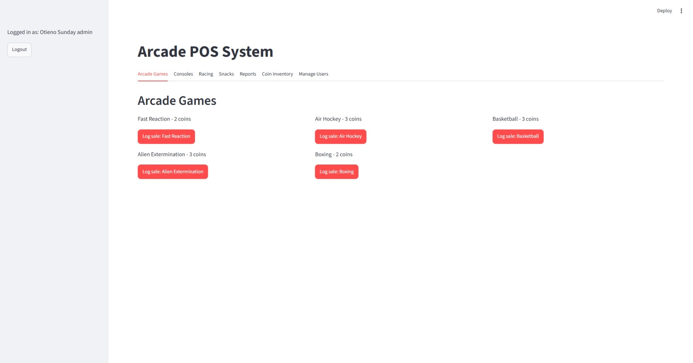
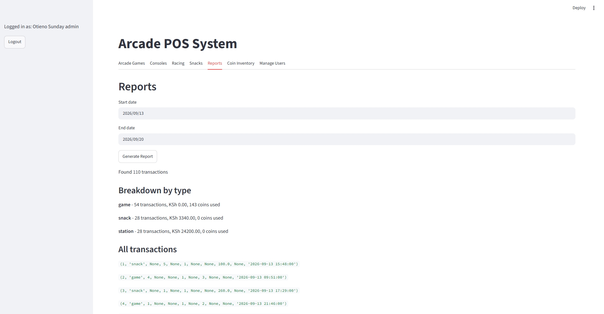
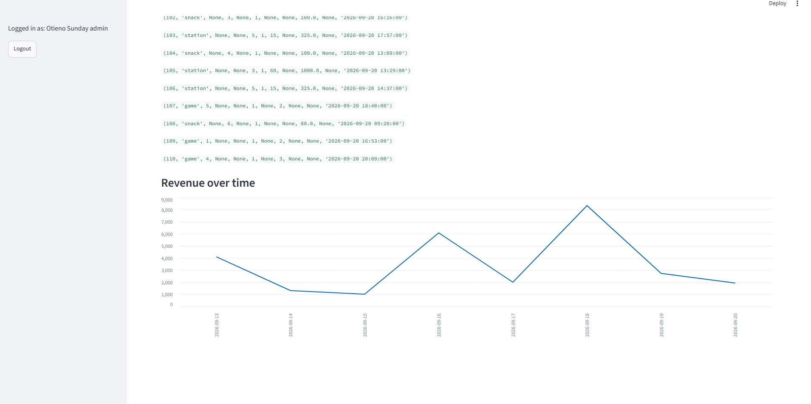

# Arcade POS System

A point-of-sale and transaction management system built for a gaming lounge, designed to replace a legacy in-house system that had a critical limitation: **no historical data retention**. The original system could only summarize "today," "last 7 days," or "last 30 days" — it had no way to query sales for a specific past date or custom date range.

This project solves that problem from the ground up with a proper relational database design, while also fixing a real coin-inventory tracking bug identified in the legacy system, and adding secure, role-based user authentication.

## The problem

At the gaming lounge where I work, the existing POS system logs every arcade game, snack, and console/racing rental sale — but discards the underlying detail once a day ends, keeping only rolling summaries. This made it impossible to answer basic business questions like:

- "How many games were played on a specific date last month?"
- "What was our total revenue for a custom date range?"
- "How much of our revenue came from snacks vs. games vs. console rentals over a given period?"

The system also had a coin-inventory bug: when an admin restocked the coin machine, the new count was added to whatever coins remained, rather than replacing it — leading to inaccurate coin balances over time.

## The solution

I designed and built a replacement system with:

- **A proper relational database** (SQLite) where every transaction is permanently logged with a full timestamp — nothing is ever summarized-and-discarded. Historical queries for any date or date range are now a simple SQL query away.
- **A fixed coin-inventory model**: every restock is treated as a fresh, authoritative snapshot of the true coin count, with remaining coins calculated on demand (latest restock minus coins used since) — eliminating the double-counting bug in the original system.
- **Secure authentication**: passwords are hashed with `bcrypt` (never stored in plain text), with a first-time setup flow for creating the initial admin account and role-based access control separating cashier and admin permissions.
- **A clean, functional dashboard** built in Streamlit, covering all of the lounge's sale types — arcade games, PlayStation consoles, racing stations, and snacks — plus a reporting tab with custom date-range filtering, revenue breakdowns by category, and a revenue-over-time chart.

## Features

- Log sales for 5 arcade games (coin-based), 3 console stations and 3 racing stations (time-based, priced per minute), and 6 snack items (cash-based)
- Full transaction history with exact timestamps — queryable by any date or date range
- Revenue reporting: totals, breakdown by transaction type, and a line chart of revenue over time
- Coin inventory tracking that correctly handles restocks without double-counting
- Role-based authentication: admins can manage coin inventory and create new user accounts (cashier or admin); cashiers only see day-to-day sales tabs
- Responsive grid layout for browsing and logging sales

## Tech stack

- **Python** — application logic
- **SQLite** — relational database, zero external dependencies
- **Streamlit** — web-based interface
- **bcrypt** — password hashing
- **pandas** — data querying and chart preparation

## Database design

The system uses six tables:

| Table | Purpose |
|---|---|
| `arcade` | Reference list of coin-based arcade games and their coin costs |
| `snacks` | Reference list of snack items and their cash prices |
| `stations` | Console/racing rental stations, their hourly rates and IP addresses |
| `transactions` | Single source of truth — every sale ever made, with a full timestamp |
| `coin_inventory` | Admin coin restock log (snapshot-based, not additive) |
| `users` | User accounts with hashed passwords and roles |

Every report — daily, weekly, by custom date range, by category — is derived directly from `transactions`, rather than relying on pre-computed summaries. This is the core design decision that solves the original historical-data problem.

## Screenshots

**Arcade Games tab** — logged in as admin, showing the grid layout and live coin costs:



**Reports tab** — custom date-range filtering with a revenue breakdown by transaction type (this is the feature that directly solves the original historical-data problem):



**Reports tab** — revenue over time, generated from the same query:



**Login screen** — role-based access secured with bcrypt password hashing:


## Running it locally

```bash
pip install streamlit bcrypt pandas
python database.py
python seed_data.py
streamlit run app.py
```

On first run, the app will prompt you to create an admin account before showing the dashboard.

## Background

I built this after identifying the historical-data gap in my employer's actual POS system while working at the gaming lounge. This project is an independent redesign — not a copy of the original system's code — focused on correcting its data-retention and coin-tracking limitations.
